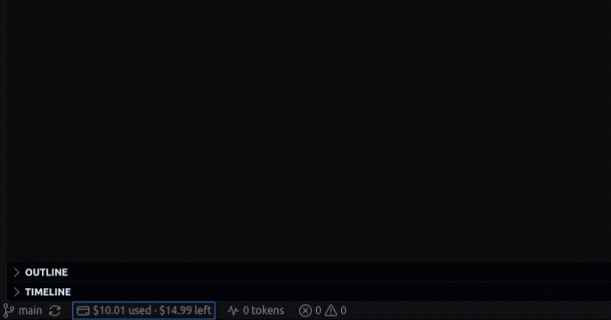

# OpenRouter Monitor

Track your [OpenRouter.ai](https://openrouter.ai) credit usage and token consumption directly from the VS Code status bar.



## Features

- **Connects to OpenRouter.ai** using your personal API key (stored securely via VS Code's Secret Storage — never written to disk in plain text).
- **Status bar credit tracker** — shows USD used and USD remaining, e.g.:
  `💳 $3.42 used · $46.58 left`
  Hover for a full breakdown (used today/week/month, per-key limit, account balance). Click to open a details menu.
- **Status bar token tracker** — shows accumulated token usage, e.g.:
  `📈 12,480 tokens`
- **Auto-refresh** on a configurable interval (default: every 5 minutes).
- **`OpenRouter: Ask Model`** command — send a quick prompt to any OpenRouter model from the Command Palette; the response's `usage` data (prompt/completion/total tokens) is added to your running local total and printed to the "OpenRouter Monitor" output channel.

## Why two data sources for credits?

OpenRouter exposes two endpoints:

- `GET /api/v1/key` — always available with a normal API key. Reports all-time/day/week/month USD usage and any per-key spending cap you've configured.
- `GET /api/v1/credits` — reports your total purchased credits and total usage account-wide (`total_credits - total_usage` = remaining balance). This extension calls it opportunistically; if your key/account doesn't have access to it, the status bar falls back to the per-key limit info instead.

## Why is "tokens used" tracked locally?

OpenRouter's account/key APIs report **USD** usage, not a running token counter (since cost per token varies per model). To give you a token count, this extension tracks the `usage` object returned by the chat completions API for any request you send through the built-in **OpenRouter: Ask Model** command, and accumulates it in VS Code's global storage. It is not a proxy for other extensions or terminals — only requests made through this extension's own command are counted.

## Getting started

1. Install the extension.
2. Run **OpenRouter: Set API Key** from the Command Palette (`Cmd/Ctrl+Shift+P`) and paste in a key from <https://openrouter.ai/keys>.
3. The status bar will populate automatically. Click either status bar item to see full details, refresh manually, ask a model a question, or reset local token stats.

## Commands

| Command | Description |
| --- | --- |
| `OpenRouter: Set API Key` | Store/replace your OpenRouter API key |
| `OpenRouter: Refresh Usage Now` | Force an immediate refresh of credit info |
| `OpenRouter: Show Usage Details` | Open a quick-pick with full usage details and actions |
| `OpenRouter: Ask Model (tracks token usage)` | Send a one-off prompt and accumulate token usage |
| `OpenRouter: Reset Local Token Stats` | Reset the locally tracked token counters to zero |

## Settings

| Setting | Default | Description |
| --- | --- | --- |
| `openrouterMonitor.refreshIntervalMinutes` | `5` | How often to auto-refresh credit usage. `0` disables auto-refresh. |
| `openrouterMonitor.defaultModel` | `openai/gpt-4o-mini` | Default model slug pre-filled in the "Ask Model" command. |

## Building / running locally

```bash
npm install
npm run compile
```

Then press `F5` in VS Code (with this folder open) to launch an Extension Development Host with the extension loaded.

## Packaging

```bash
npx @vscode/vsce package
```

This produces a `.vsix` file you can install via **Extensions: Install from VSIX...** in VS Code.

## Privacy

Your API key is stored using VS Code's `SecretStorage` API, which uses the OS keychain/credential manager — it is never written to a settings file or synced in plain text. All requests go directly from your machine to `openrouter.ai`; no third-party servers are involved.
